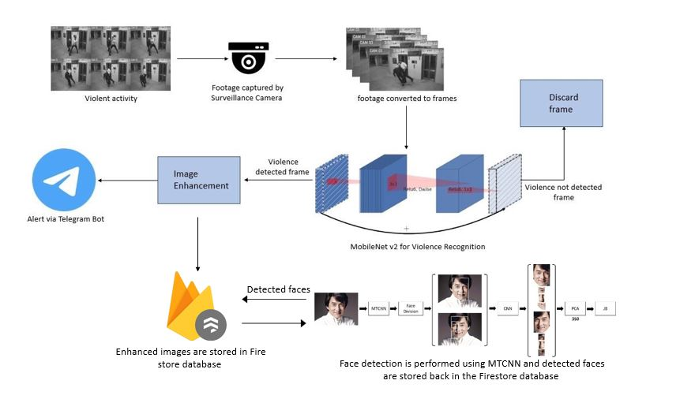
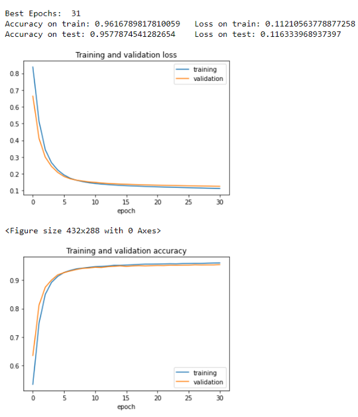
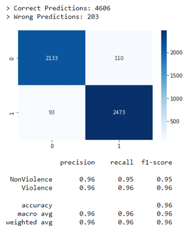
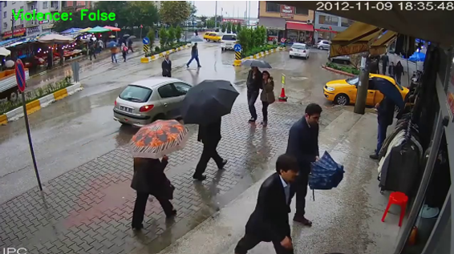

# Violence Detection using Deep Learning

## Introduction

Violent behavior in public places is a significant issue that affects communities worldwide. It diminishes productivity, lowers property values, and disrupts social services. Recognizing violence in real-time videos captured by surveillance cameras is challenging but essential for prompt intervention. This project focuses on developing a real-time violence detection system using deep learning, specifically MobileNetv2, to detect violent activities in video footage captured by surveillance cameras. The system enhances the output frames and sends alerts to nearby authorities via a Telegram bot for timely intervention.

## Objectives

1. Address the issue of violence in public places and its negative effects on communities.
2. Develop a reliable real-time violence detection system capable of promptly alerting authorities when violent activities occur.
3. Utilize public video surveillance systems to their full potential by automating the detection of violent scenes, eliminating the need for manual monitoring.
4. Implement a Real-Time violence alert system that enhances the output frames from the model, includes time and location details, and sends alerts to nearby police stations for timely intervention.

## Architecture

Footage from surveillance cameras is processed into frames, which are then inputted into the MobileNet v2 classifier for detecting violent activities. Detected violent frames are enhanced for better clarity using image enhancement techniques. The enhanced frames, along with location details, are sent to nearby authorities via a Telegram bot for timely intervention.

### Dataset

The dataset contains 1000 video clips categorized into violence and non-violence classes. Each video clip is approximately 5 seconds long, primarily sourced from CCTV footage.

## Operating Environment

1. **Python**: Utilized for its extensive library support, especially in machine learning and deep learning projects.
2. **Google Colaboratory**: A web application by Google, used for Python-based projects like machine learning and deep learning, providing access to Graphical Processing Units (GPUs) or Tensor Processing Units (TPUs) for free, crucial for computationally intensive tasks.

## Results

Training and testing accuracy are displayed graphically. The MobileNet v2 model achieved 96% accuracy on the training set and 95% accuracy on a testing set comprising CCTV footage not included in the dataset.

Output frames correctly recognizing violence and non-violence are shown below:

## Conclusion

The development of a real-time violence detection system using deep learning represents a significant step towards enhancing public safety and security. By leveraging advanced technologies such as MobileNetv2 and image enhancement techniques, the system can accurately detect violent activities in surveillance footage and promptly alert authorities for intervention. 

## Contributors

Our project's success is a testament to the power of teamwork and collaboration. Each member of our team brought unique skills, knowledge, and enthusiasm to the table, contributing to the project's development in diverse ways.
Here are our group members:

1. [Mangesh Pangam](https://github.com/Mangesh2704)

2. [Rakshita Sarap](https://github.com/RakshitaSarap)

3. [Saish Rane](https://github.com/saishrane-11)

## Acknowledgments

- Special thanks to the developers of MobileNetv2 for their contribution to deep learning architectures.
- Inspiration and guidance from various resources and contributors in the field of computer vision and machine learning.
